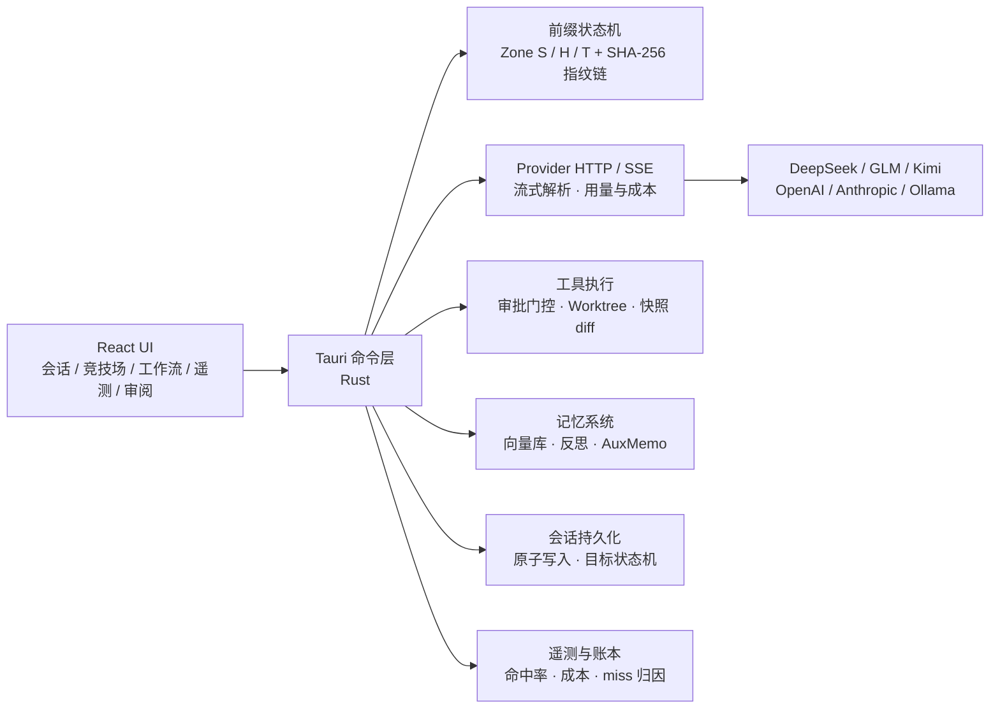

<div align="center">


# CCHarness

### 把多个大模型装进同一个桌面工作台

**自带模型 · 缓存是一级指标 · 智能体干活，掌控在你**


[](./LICENSE)
[](https://github.com/Technicalflight/CCHarness/issues)

**[在线官网](https://technicalflight.github.io/CCHarness/)**

</div>

> [!IMPORTANT]
> CCHarness 处于早期开发阶段（v0.1.x），数据格式与接口随时可能变化。项目基于 **AGPL-3.0** 开源——欢迎 Star、Issue 与 PR。

CCHarness 是一个自带模型（BYOM）的桌面工作台：一个界面管理多家 Provider，流式多会话对话，七种工作流模式按任务切换，真实智能体循环直接读写你的工作区——并且把**前缀缓存命中率**当作一级指标内置在遥测面板里。

---

## 下载安装

前往 [Releases](https://github.com/Technicalflight/CCHarness/releases) 页面下载对应平台的安装包（自 v0.1.0 起提供三平台构建）：

| 平台 | 文件 | 说明 |
|:--|:--|:--|
| Windows | `.exe`（NSIS 安装向导）或 `.msi` | x64 |
| macOS | `.dmg` | Apple Silicon + Intel 通用二进制 |
| Linux | `.deb` / `.rpm` / `.AppImage` | Debian 系 / 红帽系 / 免安装运行 |

安装包未做代码签名：Windows 首次运行可能出现 SmartScreen 提示（点「仍要运行」）；macOS 首次打开需在「系统设置 → 隐私与安全性」中放行。应用内置**更新检查**——点击侧边栏底部的版本号或在设置页开启启动自动检查，发现新版本会提示前往 Releases 下载。

## 为什么选择 CCHarness？

| | |
|:--|:--|
| 🧭 **桌面优先** | 原生桌面应用而非浏览器标签页：直接读写工作区文件、`@` 文件引用补全、系统级通知、`Ctrl+K` 命令面板，会话与配置全部留在本机。 |
| 💰 **缓存是一级指标** | 上游前缀缓存命中 token 约 1/10 价格。CCHarness 在**请求侧制造可缓存性**（而非在响应侧猜测相似性），命中率曲线、逐请求账本、miss 归因全部内置进遥测面板。 |
| 🔄 **工作流引擎** | 智能体 / 规划 / 目标 / 深度推理 / 审阅 / 生图 / 自定义状态机——七种模式一个下拉切换，权限边界、指令注入、工具面随模式自动收敛。 |
| 🔒 **Local-first** | 会话、API Key、记忆全部落在本机：Key 经系统级加密（Windows DPAPI / macOS 钥匙串 / Linux 密钥环），请求直连你配置的 Provider，不经过任何第三方中转。 |

## 从提示词到补丁

1. **描述任务** —— 在输入框直接说；`@` 引用工作区文件，拖入或粘贴图片多模态提问，草稿可一键「✨ 优化」为更清晰的提示词（幂等调用走本地缓存，不重复计费）。
2. **模型调用工具** —— 智能体模式拥有 16+ 工具（读 / 写 / 编辑 / 命令 / 网页 / MCP / 记忆 / 截屏 / 子代理委派）；写与改默认逐项审批，切换免审批档会弹出**风险确认对话框**（列明可能删除文件 / 清空数据等行为，勾选责任条款才能启用，档位常驻红色警示）。
3. **快照留痕** —— 每次 write / edit 保留前后快照，行级 diff 在审阅面板过目；完整工具调用记录（含被拒绝的调用）可回溯。
4. **你审阅，你决定** —— 批准或拒绝每一处改动；开启 Worktree 隔离后，所有写操作重定向到 git 工作树，主工作区在合并前不被触碰，随时整体丢弃重来。

---

## 不止一个聊天窗口

会话即工作流，一个下拉切换：

| 模式 | 行为 |
|---|---|
| 🤖 **智能体** | 完整工具面：读写文件、执行命令、委派子智能体 |
| 📋 **规划** | 只读调研，输出 ```plan 方案卡；批准前不修改任何文件，批准后自动切回智能体执行 |
| 🎯 **目标** | 只锁目标与验收标准：每轮输出 ```goal 清单（✅/⬜ + 可核验证据），全部达成输出 GOAL_DONE，前端有界自动继续 |
| 🧠 **深度推理** | ToT 思维树：三路候选方案并行生成，judge 模型评审择优后执行 |
| 🔍 **审阅** | 三专家并行只读预审（正确性 / 安全边界 / 可维护性），汇合去重定级输出结构化发现表，工具面强制只读 |
| 🎨 **生图** | 走 `/images/generations` 端点的独立图像生成会话，模型列表自动过滤 |
| 🔀 **自定义状态机** | 可视化编辑的声明式工作流：每状态独立指令 + 工具面 + 条件分支 + 并行扇出，支持断点续跑 |

### 目标模式：对齐 Codex `/goal` 的完整状态机

- **五态生命周期**：`active → paused / achieved / unmet / budget_limited`，持久化进会话元数据，重启存活；
- **`/goal` 命令面**：`/goal <目标>` 创建 · `/goal` 查看摘要 · `/goal pause / resume / clear`；
- **工具化目标管理**：模型可调用 `get_goal / create_goal / update_goal` 三个工具自主读取与推进目标，但**只能**标记 `achieved / unmet`——暂停 / 恢复 / 清除是用户专属权限；
- **五段式目标模板**（Objective / Scope / Constraints / Done when / Stop if）内置于创建引导；
- **证据审计**：8 条完成判定规则——✅ 必须附可核验证据（文件路径 / 命令输出 / 测试名），代理信号不算数，存疑即 ⬜；
- **预算软停止**：会话成本达到上限时，下一次自动继续变为一次性收尾指令（完成手头原子操作 + 最终清单 + 总结），而非硬中断。

### 多智能体协作

- **竞技场**：一条提示词同时发给 N 个模型并行作答，泳道并排对比，逐轮 token / 缓存命中 / 成本一目了然；
- **圆桌群聊**：多成员顺序发言，主持人 LLM 负责调度发言顺序与话题收敛；
- **子智能体**：具名角色档案（独立 Provider / 模型 / 系统提示词），把独立调研 / 分析子任务委派给后台——独立上下文、实时进度流式显示、完整过程落盘可查；状态机工作流支持并行扇出多子代理会师。

### 右侧工作区面板

| 面板 | 能力 |
|---|---|
| 📁 文件 | 工作区文件树浏览与预览，写工具成功后自动刷新 |
| 🌿 Git | 暂存 / 提交 / 分支 / 远程 / 推拉完整闭环，行级 diff，无需离开应用 |
| 🌐 浏览器 | 内嵌实时预览本地 dev server，一键切换**手机视口模拟**（不重载页面） |
| ✅ 任务 | 智能体长任务的 `todo_write` 计划清单实时同步 |

另有会话置顶 / 归档分组、消息分支、外部会话导入、Markdown 导出、压缩上下文（70% 自动触发 + 手动）。

## 你的模型，你做主

CCHarness 不绑定任何模型厂商。内置适配 DeepSeek、智谱 GLM、Kimi、OpenAI、Anthropic、Ollama 本地模型，以及任意 OpenAI 兼容端点：连接测试、一键获取模型列表、按模型配置定价与上下文窗口；品牌图标内联 [@lobehub/icons](https://lobehub.com/icons) 官方 SVG。

## 扩展生态

- **MCP**：接入任意 Model Context Protocol 服务器，工具自动并入模型工具面，连接状态可视化管理；
- **Skills**：本地技能 + 内置技能市场（SkillHub），模型可用 `load_skill` 工具按需自主加载；
- **子智能体档案**：在「子智能体」页为不同角色配置专属模型与提示词；
- **注入防护**：外部内容（网页 / MCP 返回）默认经过 Guardrails 注入检测与数据围栏包裹，中英文注入短语库可自定义扩充。

## 记忆系统

- **向量长期记忆**：OpenAI 兼容 embeddings 端点 + 余弦相似度召回，按工作区隔离，FIFO 容量控制；
- **自动反思**：回合结束后自动提炼 0–3 条记忆写入向量库，全程静默；
- **提示词增强**：AuxMemo 精确缓存（L1 内存 LRU + L2 加密磁盘），相同草稿零 API 调用零计费。

## 评测

内置 Benchmark 视图：8 类基准用例（算术 / 逻辑 / 中文 / 指令 / 代码 / 概括 / 建议 / 常识），关键字判分 + 可选 **LLM-as-judge** 评审（通过 / 评分 / 理由），历史记录保留 50 轮。

## 请求侧缓存工程（本项目的差异化设计）

CCHarness 把智能放在**请求侧**：制造可缓存性，而不是在响应侧猜测相似性。每个出站请求按字节分三区：

```
Zone S  冻结区   system prompt，会话内一次写定，字节永不变化
Zone H  历史区   append-only：已发送内容以预序列化字节入史，任何组件不得改写
Zone T  尾区     本轮新增（用户消息），下一轮落入 H 成为稳定前缀
```

- 请求体由**预序列化片段按字节拼接**组装，保证 provider 看到逐字节相同的前缀——这是上游前缀缓存命中的前提；
- SHA-256 增量指纹链跟踪前缀演化；模型切换等事件开新**纪元**，遥测把「预期重建」与「意外劣化」分开统计；
- **miss 分歧定位**：provider 报 0 命中而本地链完整时，按请求形态自动归因（链断裂 → 前缀回退 → 尾区过大 → 上游丢失），附处置建议；
- **辅助调用精确缓存（AuxMemo）**：标题生成 / 提示词增强等幂等调用走 L1 + L2 缓存，命中不产生 API 调用与计费；
- **明确不做**：语义缓存、主循环响应重放、跨工作区共享。

## 安全护栏

| 层 | 机制 |
|---|---|
| 权限档位 | 只读 / 需审批 / 自动写入三级；自动写入需**风险确认对话框**（责任条款勾选），档位红色标识 |
| 审批卡 | 每次写操作弹出预览与 diff，120 秒超时即拒绝（fail-closed） |
| Worktree 隔离 | 写操作重定向 git 工作树，合并前主工作区零触碰 |
| 注入检测 | 外部内容围栏包裹 + 伪造围栏标记转义 |
| SSRF 防护 | 默认拒绝环回 / 内网 / 链路本地地址，本地模型服务需显式白名单 |

## Local-first

| 数据 | 存储 | 保护 |
|---|---|---|
| 会话 | 本机应用数据目录 | 原子写入（tmp + rename），损坏自动备份重建 |
| API Key | 本机应用数据目录 | 系统级加密落盘：Windows DPAPI / macOS 钥匙串 + AES-GCM / Linux 密钥环（Secret Service）+ AES-GCM；密钥环不可用时降级明文并明确提示 |
| 辅助调用缓存 | L1 内存 LRU + L2 磁盘 | 工作区隔离、静态加密、8 MiB 有界 |
| 出站请求 | 直连你配置的 Provider | 不经过任何第三方中转 |

## 架构



技术栈：Tauri 2 + React 18 + TypeScript（strict）/ Rust 后端约 12,000 行 + 前端约 11,700 行，98+ 个后端单元测试覆盖前缀字节稳定性、SSRF、Git 面板、worktree 往返等核心链路。

## 开发

环境要求：Node ≥ 22、Rust ≥ 1.77、Windows / macOS / Linux。

```bash
npm install          # 前端依赖
npm run tauri dev    # 开发模式（自动起 vite + cargo）
npm run tauri build  # 打包安装程序
```

单独验证：

```bash
npm run typecheck    # tsc --noEmit
npm run build        # tsc + vite build
cd src-tauri && cargo test    # 后端单元测试
node scripts/gen-icons.mjs    # 重新生成图标
```

目录结构：

```
src/                    React 前端
  App.tsx               布局 / 视图路由 / 全局快捷键
  store.ts              zustand 全局状态
  types.ts              前后端共享 wire 类型
  components/           Sidebar / Composer / 面板 / 命令面板 / 宠物
  views/                会话 / 竞技场 / 工作流 / 子智能体 / 审阅 / 评测 /
                        市场 / 模型管理 / MCP / 遥测 / 设置
  lib/                  Tauri API 封装、格式化、配色、图标
src-tauri/src/          Rust 后端
  main.rs               Tauri 2 入口 / AppState / 命令注册
  prefix.rs             三区前缀状态机 + 指纹链（含字节稳定性测试）
  sysprompt.rs          Zone S 分层系统提示组装
  chat.rs               Provider HTTP / SSE / 图像生成 / 用量与成本
  commands.rs           Tauri 命令层（会话编排 / 工具循环 / 目标状态机）
  agent_tools.rs        只读内置工具（schema 注入 + 进程内受控执行）
  mcp.rs                MCP 客户端运行时（stdio / HTTP，JSON-RPC 2.0）
  spill.rs              超长工具结果落盘（留一行存根可读回）
  confidence.rs         流侧置信度标记提取
  divergence.rs         缓存未命中定位（本地指纹链 vs Provider 报告）
  warmer.rs             可选缓存保温（空闲保活探针）
  deepfiles.rs          图片 Files API 复用（file_id 引用）
  auxmemo.rs            辅助调用精确缓存（L1 LRU + L2 加密磁盘 + 账本）
  memvector.rs          向量长期记忆（embeddings + 余弦召回）
  privacy.rs            伪匿名化隐私模式（类型一致代换）
  guard.rs              注入检测（Guardrails）
  urlguard.rs           SSRF 防护（含测试）
  skills.rs             技能提示层插件（markdown + frontmatter）
  skillhub.rs           SkillHub 市场集成
  importer.rs           本地 agent-CLI 会话 JSONL 导入
  worktree.rs           git worktree 隔离生命周期
  git_panel.rs          Git 面板命令（暂存/提交/分支/远程）
  bench.rs              Benchmark + LLM-as-judge
  sessions.rs           会话持久化 + Markdown 导出
  types_rs.rs           跨模块 wire 类型（与 src/types.ts 一一对应）
  config.rs             配置加载 / 密钥封存
  update.rs             应用内更新检查（GitHub Releases）
```

## 项目状态

- 当前版本 v0.2.0，处于快速迭代期，更新日志见 [Releases](https://github.com/Technicalflight/CCHarness/releases)；
- v0.2.0：第二轮深度审计全项闭环 + 协议与网络专项——工具写路径符号链接逃逸防护、网页抓取重定向逐跳「解析后锁定」、glob 与沙箱命令匹配加固、后台命令移入线程池并支持进程树整体击杀、MCP 服务进程生命周期治理（死进程自愈 / 有界重试）、停轮遗留工具调用自愈（中断会话重启后不再报协议错误）、流式工具调用参数分片组装修复（此前参数可能静默丢失）、工具定义注入请求体、流式响应改空闲读超时（长生成不再被总时长掐断）、辅助记忆台账自动裁剪 / 隐私库与溢出目录随会话清理 / 文件索引过期驱逐、旧版配置文件无损加载（并修复旧配置可能发出空推理档位）、git 推送 / 拉取 / 抓取转异步不再冻结界面、流式期间历史消息零重渲染（长会话更顺滑）、输入法组合键防误触、慢响应跨会话守卫；
- v0.1.9：安全与稳定性专项（外部深度审计全项闭环）——工作区路径穿越防护、CSP 收紧、API 密钥界面掩码 + 落盘加密密封、会话写入原子化并纳入保存锁、中文感知 token 估算（修复中英混排下自动压缩触发滞后）、SSE 分帧兼容、工具集哈希跨版本稳定、沙箱匹配加固、MCP 环境变量白名单与私网重定向拒绝、网页抓取防 DNS 重绑定、删除确认与双发修复、mermaid 漏洞依赖链替换、技能内容安全扫描；架构重构——全局状态收编进应用状态、6190 行核心文件拆分为工作流 / 压缩 / 发送引擎三模块；新增 CI 质量门（构建 + 全量测试）；README 源码地图补全；
- v0.1.8：缓存工程专项——超长工具结果自动落盘（留一行存根可读回）；过时工具输出降级存根；三桶对账压缩（KEEP 逐字节保留 / FOLD 折叠为结构化摘要 / DROP 降级）+ 回本门槛 + 迟滞 + 抖动保护；RollingMemo 滚动备忘（每轮零成本提炼会话状态）；in-history 系统提示更新（稳定前缀字节不回退）；可选缓存保温（推理绑定模型空闲自动保活）；子智能体稳定缓存分片（跨运行字节级命中）；gzip / zstd 压缩传输；图片 Files API 跨轮复用；遥测新增「压缩账本」；修复右侧功能区开启（窄主区）时遥测宽表格溢出裁切；
- v0.1.7：深度推理 / 审阅等模式首字前不再"卡住"——助手消息框即时出现并显示预演阶段进度（三方案预演 / 三专家预审 / 记忆检索）；记忆召回、深度推理预演、审阅预审、MCP 预热、自动压缩全链路响应暂停（约 0.1 秒内中止，无需刷新页面）；中止回合缓存指纹链正确收尾，不再误报"前缀链断裂"告警；
- v0.1.6：协议适配器矩阵拓宽——新增 OpenAI Responses 与 Azure OpenAI（Responses）适配器（GPT-5.x / o 系列原生接口、Azure v1 数据面 api-key 认证）；缓存 TTL 三档位（默认 / long / short / none，模型管理页可选，原 24h 开关自动迁移）；Anthropic 缓存记账修复（输入 / 写入 / 读取三桶互斥按厂商归一，未命中检测与成本核算修正）；
- v0.1.5：应用内更新检查节流调整为每天一次（启动静默检查 24 小时一次，发现更新仅徽标 + 提示、手动下载）；
- v0.1.4：模型缓存时间调整为 60 分钟（Anthropic 请求携带 cache_control ttl 1h）；隐私匿名化修复 +86 国际前缀手机号识别并新增自定义正则脱敏；隐私映射 JSONL 日志（设置页可查看 / 清空）；策略沙箱文件 / 命令 / 网络三维自定义清单与三态裁决；应用内更新检查节流缩短为 60 分钟；
- v0.1.3：新增「审阅」工作流模式（三专家并行只读预审，汇合定级输出发现表）；写后自动验证钩子（post_write_command，验证不依赖模型自觉）；目标模式证据分级（无证据的 ✅ 计「待补」）；智能体宪法质量纪律；技能路由阶梯与记忆隐私红线；
- v0.1.2：仓库公开开源（AGPL-3.0）；应用内更新检查开箱即用——移除设置页的 GitHub 访问令牌配置，匿名即可检查；
- v0.1.1：应用内更新检查（侧边栏版本号 / 启动自动检查）、macOS / Linux 下的 Key 等价保护（钥匙串 / 密钥环保存主密钥 + AES-256-GCM 加密落盘）；
- 路线图：RAG 知识库管线、A2A 协议接入、签名自动更新器。

## Built on open source

感谢 [Tauri](https://tauri.app)、[React](https://react.dev)、[zustand](https://zustand.docs.pmnd.rs)、[react-markdown](https://github.com/remarkjs/react-markdown)、[@lobehub/icons](https://lobehub.com/icons) 与 Rust 生态的众多 crate。

本项目在 AI 模型协作下开发。

## 社区联系

[Linux.Do](https://linux.do) — 一个分享和讨论技术的社区。

## ☕ 赞助 / Sponsor

如果 CCHarness 对你有帮助，欢迎请作者喝杯咖啡或可乐 ☕🥤——每一杯都是持续开发的动力。

<p align="center">
  
  &nbsp;&nbsp;&nbsp;&nbsp;&nbsp;&nbsp;
  
</p>
<p align="center"><sub>左：支付宝 Alipay &nbsp;·&nbsp; 右：微信 WeChat Pay</sub></p>

> [!WARNING]
> **赞助前请务必阅读**：赞助是**完全自愿**的感谢行为。**赞助不会提高或加快任何功能、缺陷修复或其他工作的实现优先级**——所有开发均按路线图与社区需求推进，与是否赞助、赞助多少完全无关。赞助仅代表感谢，不构成任何商业授权、优先支持或其他额外承诺。

## 许可证 / License

CCHarness is licensed under the **GNU Affero General Public License v3.0 (AGPL-3.0)**, available at <https://www.gnu.org/licenses/agpl-3.0.html> — see the [LICENSE](./LICENSE) file for the full text.

Use of CCHarness for **commercial purposes is permitted**, subject to full compliance with the terms and conditions of the AGPL-3.0 license — including its network-use clause: if you modify CCHarness and offer it as a network service, you must make the complete corresponding source code available to the users of that service.

Should you require a **commercial license** that provides an exemption from the AGPL-3.0 requirements (e.g. closed-source or internal deployment without the source-disclosure obligations), please open an issue at <https://github.com/Technicalflight/CCHarness/issues> to contact the author.

---

中文说明：本项目社区版采用 **AGPL-3.0** 许可证。你可以自由地使用、学习、修改和分发本项目（包括商业用途），但必须完整遵守 AGPL-3.0 全部条款——尤其是**网络服务条款**：修改后的版本若以网络服务形式提供给他人使用，必须向使用者提供完整的对应源代码。如需**豁免上述开源义务的商业授权**（如闭源部署、OEM 集成），请通过 [GitHub Issues](https://github.com/Technicalflight/CCHarness/issues) 联系作者洽谈。
