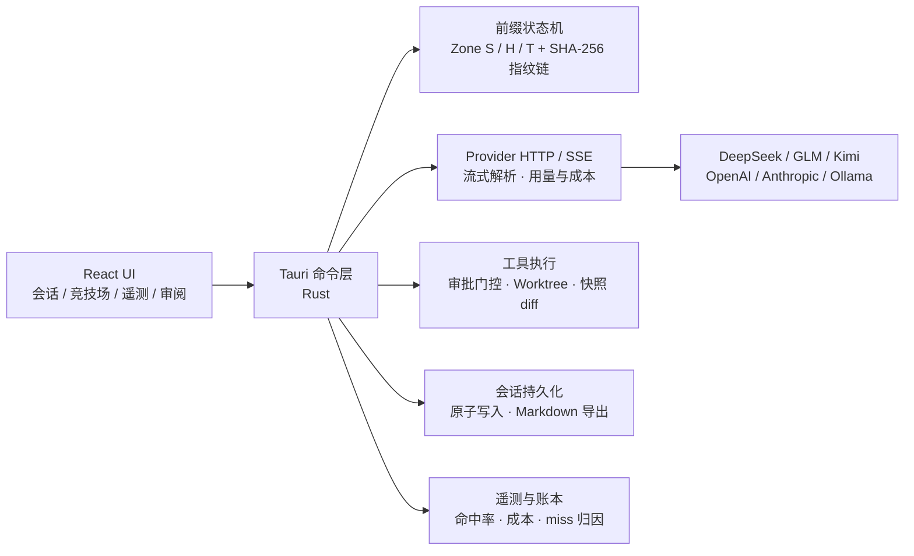

<div align="center">


# CCHarness

### 把多个大模型装进同一个桌面工作台

**自带模型 · 缓存是一级指标 · 智能体干活，掌控在你**
**Bring your own model. Cache every token twice. Let agents build — while you stay in control.**


</div>

> [!IMPORTANT]
> CCHarness 处于早期开发阶段（v0.1.x），数据格式与接口随时可能变化。本仓库当前为**私有项目**，未经作者许可请勿分发。

CCHarness 是一个自带模型（BYOM）的桌面工作台：一个界面管理多家 Provider，流式多会话对话，竞技场并行对比多个模型的回答，真实的智能体循环直接读写你的工作区——并且把**前缀缓存命中率**当作一级指标内置在遥测面板里。

## 为什么选择 CCHarness？

| | |
|:--|:--|
| 🧭 **桌面优先** | 原生桌面应用而非浏览器标签页：直接读写工作区文件、`@` 文件引用补全、系统级通知、`Ctrl+K` 命令面板，会话与配置全部留在本机。 |
| 💰 **缓存是一级指标** | 上游前缀缓存命中 token 约 1/10 价格。CCHarness 在**请求侧制造可缓存性**（而非在响应侧猜测相似性），命中率曲线、逐请求账本、miss 归因全部内置进遥测面板。 |
| 🤖 **真实的智能体循环** | 工具调用、逐项审批、规划闸门、目标推进、子智能体委派、快照 diff 审阅——不是聊天框套壳，而是让模型在你掌控下动手干活。 |
| 🔒 **Local-first** | 会话、API Key、缓存全部落在本机：Key 经系统 DPAPI 加密，请求直连你配置的 Provider，不经过任何第三方中转。 |

## 从提示词到补丁

1. **描述任务** —— 在会话输入框直接说；`@` 引用工作区文件，草稿可一键「✨ 优化」为更清晰的提示词。
2. **模型调用工具** —— 智能体模式拥有完整工具面（读/写/编辑/命令）；写与改默认逐项审批，也可显式切换到免审批档（弹出权限警告与责任确认，档位常驻红色标识）。
3. **快照留痕** —— 每次 write/edit 保留前后快照，行级 diff 直接在审阅面板查看；完整工具调用记录（含被拒绝的调用）可回溯。
4. **你审阅，你决定** —— diff 逐行过目，批准或拒绝；改动在 git Worktree 中进行，随时可整体丢弃重来。

## 不只是聊天窗口

CCHarness 把会话升级为可切换的工作流：

| 模式 | 行为 |
|---|---|
| **智能体** | 完整工具面：读写文件、执行命令、委派子智能体 |
| **规划** | 只读调研，输出 ` ```plan ` 方案卡；批准前不修改任何文件，批准后自动切回智能体执行 |
| **目标** | 只锁目标与验收标准：每轮输出 ` ```goal ` 验收清单（✅/⬜），全部达成输出 GOAL_DONE，前端自动继续推进（有界、可随时停止） |

- **子智能体委派**：把独立调研/分析子任务委派给后台子智能体——独立会话与上下文、只读工具面、最多 3 个并行、实时进度流式显示在委派卡内，完整过程落盘可查。
- **长会话不乱**：运行中自动排队、编辑重发、消息分支（从任意一条消息派生新会话）、置顶/归档分组、导出 Markdown。
- **浏览器预览**：内嵌浏览器面板实时查看前端改动，支持一键切换手机视口模拟。

## 你的模型，你做主

CCHarness 不绑定任何模型厂商。内置适配 DeepSeek、智谱 GLM、Kimi、OpenAI、Anthropic、Ollama 本地模型，以及任意 OpenAI 兼容端点：连接测试、一键获取模型列表、按模型配置定价；品牌图标内联 [@lobehub/icons](https://lobehub.com/icons) 官方 SVG。

**竞技场模式**：一条提示词同时发给 N 个模型并行作答，泳道并排对比，逐轮 token / 缓存命中 / 成本一目了然。

## 请求侧缓存工程（本项目的差异化设计）

CCHarness 把智能放在**请求侧**：制造可缓存性，而不是在响应侧猜测相似性。每个出站请求按字节分三区（详见 [`docs/design/cache-hit-mechanism.md`](docs/design/cache-hit-mechanism.md)）：

```
Zone S  冻结区   system prompt，会话内一次写定，字节永不变化
Zone H  历史区   append-only：已发送内容以预序列化字节入史，任何组件不得改写
Zone T  尾区     本轮新增（用户消息），下一轮落入 H 成为稳定前缀
```

- 请求体由**预序列化片段按字节拼接**组装，保证 provider 看到逐字节相同的前缀——这是上游前缀缓存命中的前提；
- SHA-256 增量指纹链跟踪前缀演化；模型切换等事件开新**纪元**，遥测把"预期重建"与"意外劣化"分开统计；
- **miss 分歧定位**：provider 报 0 命中而本地链完整时，按请求形态自动归因（链断裂 → 前缀回退 → 尾区过大 → 上游丢失），附处置建议；
- **辅助调用精确缓存（AuxMemo）**：标题生成 / 提示词增强等幂等调用走 L1 内存 LRU + L2 加密磁盘缓存，命中不产生 API 调用与计费（详见 [`docs/design/auxmemo-and-enhance.md`](docs/design/auxmemo-and-enhance.md)）；
- **明确不做**：语义缓存、主循环响应重放、跨工作区共享。

## Local-first

| 数据 | 存储 | 保护 |
|---|---|---|
| 会话 | 本机应用数据目录 | 原子写入（tmp + rename），损坏自动备份重建 |
| API Key | 本机应用数据目录 | Windows DPAPI 加密落盘（macOS / Linux 等价保护在路线图） |
| 辅助调用缓存 | L1 内存 LRU + L2 磁盘 | 工作区隔离、静态加密、8 MiB 有界 |
| 出站请求 | 直连你配置的 Provider | SSRF 防护：默认拒绝环回 / 内网 / 链路本地地址，本地模型服务需显式开启白名单 |

## 架构



## 开发

环境要求：Node ≥ 22、Rust ≥ 1.77、Windows / macOS / Linux。

```bash
npm install          # 前端依赖
npm run tauri dev    # 开发模式（自动起 vite + cargo）
npm run tauri build  # 打包安装程序
```

单独验证：

```bash
npm run typecheck    # tsc --noEmit
npm run build        # tsc + vite build
cd src-tauri && cargo test    # 后端单元测试（前缀字节稳定性等）
node scripts/gen-icons.mjs    # 重新生成图标
```

目录结构：

```
src/                    React 前端
  components/           Sidebar / Composer / Markdown / Chart / 命令面板 / 宠物
  views/                会话 / 竞技场 / 模型管理 / 缓存遥测 / 设置
  lib/                  Tauri API 封装、格式化、配色、图标
  store.ts              zustand 全局状态
src-tauri/              Rust 后端
  src/prefix.rs         三区前缀状态机 + 指纹链（含字节稳定性测试）
  src/chat.rs           Provider HTTP / SSE 解析 / 用量与成本
  src/commands.rs       Tauri 命令层（会话、发送编排、遥测、提示词增强）
  src/auxmemo.rs        辅助调用精确缓存（L1 LRU + L2 加密磁盘 + 账本）
  src/urlguard.rs       SSRF 防护（含测试）
  src/sessions.rs       会话持久化 + Markdown 导出
docs/design/            设计文档（缓存命中机制、AuxMemo 与提示词增强）
```

## 项目状态

- 当前版本 v0.1.x，处于快速迭代期；
- 路线图：应用内更新检查、macOS / Linux 下的 Key 等价保护、embedding / repo map 等新辅助调用面的白名单准入。

## 许可

Copyright (c) 2026 CCHarness Authors. All rights reserved.

本项目暂未选择开源许可证，**保留所有权利**：未经作者书面许可，不得复制、修改或分发本仓库内容。
